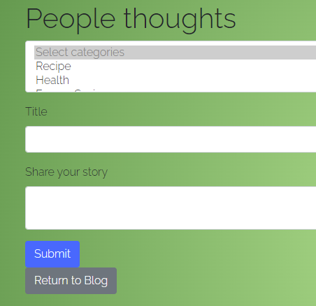
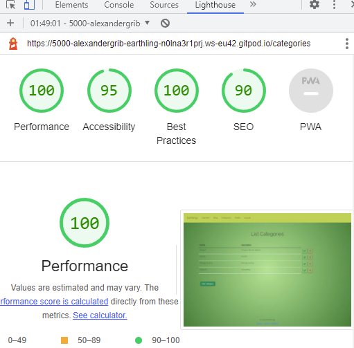

# Earthling

# Project overview

Greetings! We are the Earthlings, and this is our project to help save the only planet we have. As well as featuring a calendar with ideas of what you can do to help the earth each month, our site features a blog with the ability for users to log in to the site to contribute ideas, tips, and conversations that help keep the world turning. Users might visit this site for several reasons: to learn this month's promoted tip; to share ideas, thoughts and inspirations with other users; and to discuss these things. As such, the site features the ability to create an account, log in and out, and post from an account; the site also features authentication to securely facilitate this.

The live site for Earthlings can be found [here](https://earthlings-hackathon.herokuapp.com/).

---

# UX

This site is built to serve as a go-to place for tips, ideas and information on how to help save planet Earth. It utilises the Flask framework to handle the backend, liaising between the site and MongoDB. Users are able to register an account with the site, and through their account they can post to the site blog to share their tips and words of inspiration. On the theme of inspiration, ideas can be viewed by clicking on the landing page animation's circles to bring up a modal with content relevant to that subject. The site also features a calendar, which has different ideas for every month of the year. Blog entries can be edited and deleted from a user's profile page, and categories for blogs can be created and deleted from the categories page, giving the site full CRUD functionality.

## User stories

### A first time visitor to the site might want to:
    1. Acquire information pertaining to the environment, their impact upon it, how to minimise their impact and help the planet from the landing page animation.
    2. Read tips on how to help the planet in the calendar.
    3. Register an account on the site.
    4. Using their account, make blog posts.
    5. Subscribe to receive weekly planet-saving tips using their email address.

### A returning user to the site might want to:
    6. Delete their blog posts.
    7. Edit their blog posts.
    8. Create a new category.
    9. Read a new month's tips on how to help the planet.
    10. Explore further topics in the landing page animation.

### A site owner might want to:
    11. Facilitate the exchange of information via the hosting of a blog.
    12. Interact with site users via the blog.
    13. Send users weekly tips via the email sign-up form.
    14. Invite users to register with the site.

## Site features

The site features full registration, log-in and log-out functionality with authentication built into both the front and back end to facilitate this.

### Log-in, log-out, register and navbar

A user who is not logged in will see the above options in the navbar. The Home, Calendar and Blogs links are visible for all users, while Register and Log in will be displayed only for users not logged in.

Above is the form presented to log in to the site for a logged-out user. As you can see, the form carries an option to click a link to the register account page should a user not already have an account.

Above is what a user sees from the navbar when logged in to the site. From this, you can also see the flash message presented when a user has just logged in.

### Home page animation

The home page features an animation of moving buttons revolving around a central, stationary image. Clicking any of these buttons brings up a modal containing information on its theme, and good advice for site users to lower their impact on the planet by making changes relating to this theme.

### Categories maintenance (CRUD suite)

- The available list of categories to add to the blogs can be maintained from a menu option on the nav manu once signed in.
- The option is not available to users that are not logged in.
- From the List Categories page categories can be added, edited and deleted.
- They can only be deleted if no blogs are referring to them.

### Blog maintenance from Profile Page 

- Each user can maintain their own blogs from their profile page.  

### Blog

The blog allows users to share their thoughts, tips, ideas etc. on the theme of saving the planet.

### Calendar

The calendar has new tips for every month of the year, featuring read functionality.

---

## Wireframes

| Desktop | Mobile |
| --- | --- |
| [Home page signed in](docs/wireframes/homedesktopsignedin.png), [Home page not signed in](docs/wireframes/homedesktopnotsignedin.png), [Home page as admin](docs/wireframes/homedesktopsignedinadmin.png) | [Home page](docs/wireframes/homemobile.png) |
| [Add suggestion](docs/wireframes/addsuggestion.png) | [Add suggestion](docs/wireframes/addsuggestion.png) |
| [Categories](docs/wireframes/categoriesdesktop.png) | [Categories](docs/wireframes/categoriesdesktop.png) |
| [Suggestions signed in](docs/wireframes/suggestionsdesktopsignedin.png), [Suggestions not signed in](docs/wireframes/suggestionsdesktopnotsignedin.png) | [Suggestions signed in](docs/wireframes/suggestionsdesktopsignedin.png), [Suggestions not signed in](docs/wireframes/suggestionsdesktopnotsignedin.png) |

---

## Technologies used

* Languages:
    * [HTML5](https://en.wikipedia.org/wiki/HTML5) was used for the content and structure of the site.
    * [CSS3](https://en.wikipedia.org/wiki/CSS#CSS_3) was used for the styling of the site.
    * [JavaScript](https://en.wikipedia.org/wiki/JavaScript) was used for the interactivity of the site.
    * [Python](https://www.python.org/) was used for the back end programming of the site.

* [Flask](https://flask.palletsprojects.com/en/2.0.x/)
    * Flask was used to handle the templating for the site.

* [Flask-PyMongo](https://pypi.org/project/Flask-PyMongo/)
    * Flask-PyMongo provides MongoDB support for Flask applications.

* [pip](https://pip.pypa.io/en/stable/)
    * Pip is the package installer for Python, allowing us to install the packages we need for this site.

* [dnspython](https://www.dnspython.org/)
    * Dnspython is a DNS toolkit for python.

* [Werkzeug](https://wsgi.readthedocs.io/en/latest/what.html)
    * Werkzeug is a Web Server Gateway Interface web application library.

* [Jinja](https://www.palletsprojects.com/p/jinja/)
    * Jinja is a templating engine for Python, used to write Flask and other templating services.

* [Balsamiq](https://balsamiq.com/)
    * Balsamiq was used to create the wireframes for this project.

* [Git](https://git-scm.com/)
    * Git was used for version control and saving work in the repository, using the GitPod extension in Google Chrome to commit to GitHub.

* [Bootstrap 5](https://getbootstrap.com/)
    * Bootstrap is one of the most popular front-end open source toolkit and was used for ease of styling the Earthlings app.

* [Chrome](https://www.google.com/intl/en_uk/chrome/)
    * This project was created in the Google Chrome browser, and as such Chrome was used as the default testing browser.

* [Heroku](https://devcenter.heroku.com/)
    * Heroku is where we deploy this live site. Throughout, we have ensured the version being deployed to Heroku matches our development version by checking features and screen layouts on both versions.

* [MongoDB](https://www.mongodb.com/)
    * MongoDB is where we host our NoSQL database.

* [GitHub](https://github.com/)
    * GitHub is where we host our site.

* [Online-Convert](https://www.online-convert.com/)
    * Online-Convert was used to convert the png images to webp.

---

## Testing

The following testing was completed:

### Categories Page
- Demonstrated below is our list of tested features for the Categories page. To test the Categories page, navigate, while logged in, to the Categories page and work through the features listed here.
- - Confirmed that List Categories page appeared on selecting Categories in the Navigation Menu
- - Confirmed that it displayed the data from the categories table in the database.
- - Confirmed that clicking Add button brought me to the 'Add Category' page.
- - Confirmed that leaving the Name field blank was not allowed.
- - Confirmed that the cancel button from the Add page returned me to the List Categories page.
- - Confirmed that clicking the Save button added the new category successfully and returned me to the List Category page.
- - Confirmed that clicking the Edit icon brought me to the Edit Category page. 
- - Confirmed that the correct details of the Category were displayed on the Edit Category page. 
- - Confirmed that clicking the Save icon on the Edit Category page saved the change and returned me to the List Category page were the new details were displayed correctly.
- - Confirmed that the cancel button from the Edit page returned me to the List Categories page.
- - Confirmed that clicking the Delete icon on the List Categories page for a category which was referenced by blogs was not deleted and a message was displayed explaining.
- - Confirmed that clicking the Delete icon on the List Categories page for a category which was not referenced by blogs was deleted and I was returned to the List Categories page.

### Blog
- Demonstrated below is our list of tested features for the Blog. To test the blog, navigate to the Blog page and work through the features listed here. To post a blog, you must be logged in.
- - Confirmed that blogs display on the page, oldest first.
- - Confirmed that clicking a blog's category produces a list of blogs filtered by that category.
- - Confirmed that the "Share your ideas" button is visible only to a logged-in user.
- - Confirmed that the invitation to register or log in, which appears in place of the "Share your ideas" button appears only to a user who is not logged in.
- - Confirmed that manually changing the URL to that of the add_blog page while not logged in will result in a user being redirected to the log in page.
- - Confirmed that clicking the "Share your ideas" button navigates a user to the form to add a new blog.
- - Confirmed that categories are visible and able to be selected on the add_blog page.
- - Confirmed that the "title" and "share your story" text fields both take text.
- - Confirmed that the "Return to Blog" button returns a user to the blog.
- - Confirmed that clicking "Submit" submits a new blog.

### Registration, log in, log out
- Demonstrated below is our test of the site's full registration features. To test registration, navigate to the site's various registration pages and test according to the features listed here.
- - Confirmed that trying to register with a password that does not meet the criteria will flag an appropriate error message explaining the error.
- - Confirmed that trying to register with password fields not matching will fail to register, and an appropriate error message will show.
- - Confirmed that attempting to log in with an incorrect password will refuse log in, and display a message explaining why.
- - Confirmed that clicking "Log out" in the navbar will log a user out.
- - Confirmed that attempting to register with an exisiting username will fail, and an error message will explain why.

### Homepage animation
- Demonstrated below is our test of the site's homepage animation. To test this, navigate to the site's home page and click on the revolving images.
- - Confirmed that the animation works, by observing the animation.
- - Confirmed that the modals work when clicking on the icon.
- - Confirmed that the chevron brings a user further down the page to the calendar.

---

## Testing against user stories

In this section we have tested each user story against the features of the site to ensure that every one is met.

### A first time visitor to the site might want to:

| User story | How was this achieved? | Evidence of user story having been met |
| --- | --- | --- |
| Acquire information pertaining to the environment, their impact upon it, how to minimise their impact and help the planet from the landing page animation. | Users are presented with options of tips based upon theme when first landing on the page. Further to this, the calendar below contians a different idea for each month of the year. Finally, user's can visit the blog to share and acquire information. | [Home page animation](docs/readmeimages/homepageanimation.png), [Calendar](docs/readmeimages/calendar.png), [Blog](docs/readmeimages/blog.png) |
| Read tips on how to help the planet in the calendar. | Users are provided with a calendar, which provides a different piece of advice for every month. | [Calendar on lower section of home page](docs/readmeimages/calendar.png) |
| Register an account on the site. | User can register an account on the site. | [Registration form page](docs/readmeimages/registrationform.png) |
| Using their account, make blog posts. | Logged-in users can create blog posts via the add_blog page form. | [Add blog form](docs/readmeimages/addblog.png) |
| Subscribe to receive weekly planet-saving tips using their email address. | Users can register via the mailchimp form to recieve tips weekly in a newsletter-style email. | [Subscription form for weekly tips](docs/readmeimages/subscriptionform.png) |

### A returning visitor to the site might want to:
| User story | How was this achieved? | Evidence of user story having been met |
| --- | --- | --- |
| Delete their blog posts. | Blog posts can be deleted by the user that created them. | [Blog form delete option from profile page](docs/readmeimages/ProfilePage.jpg) |
| Edit their blog posts | Blog posts can be edited by the user that created them. | [Blog form edit option from pofile page](docs/readmeimages/ProfilePage.jpg) |
| Create a new category | Users can create a new category for blog posts with which they and other users can tag their posts via the add_category form. | [Add category form for a signed-in user](docs/readmeimages/add-category.jpg) |
| Read a new month's tips on how to help the planet. | The calendar remains static year-round, allowing users to look ahead and revisit the calendar at any time to learn a month's tips. | [Calendar on lower section of home page](docs/readmeimages/calendar.png) |
| Explore further topics in the landing page animation. | The landing page animation remains "static" (not in a literal sense) and can be visited and re-visited for learning on a different subject. | [Home page animation](docs/readmeimages/homepageanimation.png) |

### A site owner might want to:
| User story | How was this achieved? | Evidence of user story having been met |
| --- | --- | --- |
| Facilitate the exchange of information via the hosting of a blog. | The site hosts a blog for all logged-in users to contribute to, and all users to read from. | [Blog](docs/readmeimages/blog.png) |
| Interact with site users via the blog. | Blog posts can be made by any signed-in user, including a site owner. | [Add blog form](docs/readmeimages/addblog.png) |
| Send users weekly tips via the email sign-up form. | Users can register via the mailchimp form to recieve tips weekly in a newsletter-style email. | [Subscription form for weekly tips](docs/readmeimages/subscriptionform.png) |
| Invite users to register with the site. | Users are invited to register via several links on the site, and when viewing blog posts, if not logged in, the options invite them to register or log in. | [Registration form page](docs/readmeimages/registrationform.png) |

---

## Validators
The site's pages were run through a number of validators, as was its code, to ensure adherence to best practice. Below is the evidence and results of this.

### Lighthouse
* Home page

* Blog

* Log in page

* Register page

* Categories page

* Profile page

### Jigsaw

Jigsaw was used to test for errors, best practice and validity of our CSS code. The results for both of our CSS files (landing.css and style.css) were the same, so I have posted one image below to count for both.

### JSHint

JSHint was used to test for errors, best practice and validity of our JavaScript code. The results for both our JS files (landing.js and script.js) are below.

* landing.js

It is worth noting that landing.js handles the homepage landing animation which was largely copied from elsewhere (credit in the credits section) and so, in order to avoid risking any errors so close to the deadline, the missing semicolons were not replaced as the code is working happily without them.

* script.js

script.js flags an error abot the incompatibility of linting options values. With extra time, this would be an issue into which to dive deeper, but the code works, so the error - as there is only one - has been left alone for now.

### PEP8

PEP8 is used to validate Python code according to certain rules of best practice and readability. One flag exists, which is that a line containing an important string message is too long.

---

## Credits

* Content
    * Tips and suggestions used for the Monthly Eco Planner were collated from:
        * [Sustainability Mag](https://sustainabilitymag.com/top10/top-10-causes-global-warming)
        * [The Big Green K](https://thebiggreenk.com/blog/10-things-you-can-do-to-positively-impact-the-environment/)
        * [Collect My Cothes](https://collectmyclothes.co.uk/how-donating-clothes-helps-the-environment/)
        * [Sustrans.Org](https://www.sustrans.org.uk/our-blog/get-active/2020/in-your-community/five-tips-for-going-car-free)
        * [The Good Planet](https://thegoodplanet.org/2020/06/02/how-you-can-save-our-planet-by-deleting-emails)
        * [Country Living](https://www.countryliving.com/uk/homes-interiors/interiors/g25329535/eco-friendly-christmas-ideas-green-christmas/)
        * [Readers Digest](https://www.readersdigest.co.uk/lifestyle/home-garden/how-to-shop-sustainably)
        * [Greenpeace](https://www.greenpeace.org.uk/news/9-ways-reduce-plastic-use/)
        * [Panda.Org](https://wwf.panda.org/act/live_green/travel/on_vacation/)
        * [Volcanoes Safaris](https://volcanoessafaris.com/press/7-ways-to-make-your-travel-more-sustainable/)
        * [The Royal Horticultural Society](https://www.rhs.org.uk/gardening-for-the-environment/planet-friendly-gardening-tips)
        * [Lancaster University](https://www.lancaster.ac.uk/data-science-of-the-natural-environment/blogs/green-computing-a-contribution-to-save-the-environment)

* Media
    * [Adobe Stock](https://stock.adobe.com/uk/)
        * Some illustrations used for the Earthlings were licensed from Adobe.

---

## Acknowledgements

* Many thanks to the Code Institute Hackathon team for organizing these events that enables participants to collaborate with fellow student developers and alumni, experience sprint development and have fun along the way!

* We are Team Earthlings:
    * [Alex](https://github.com/alexandergrib)
    * [Daniel](https://github.com/xiaoniuniu89)
    * [Evelyn](https://github.com/evelynfoy)
    * [James](https://github.com/James-VT)
    * [Joy](https://github.com/JoyZadan)